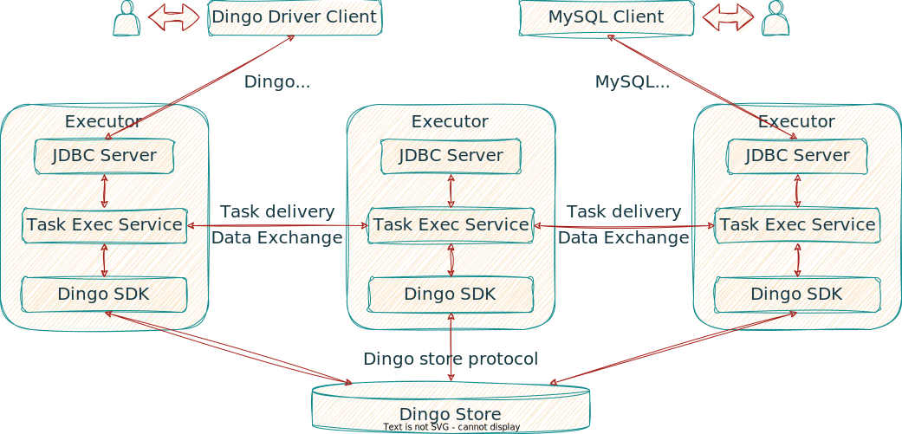
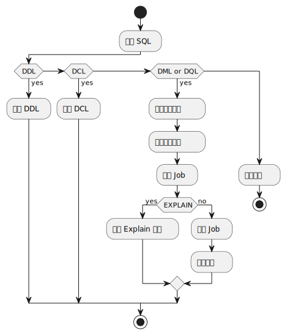
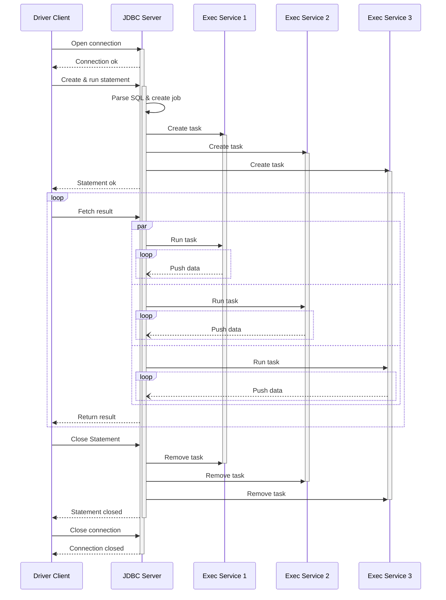

# DingoDB SQL 执行流程

## 基本流程

DingoDB 中 SQL 执行部分的架构如下图所示

一般的 DQL 和 DML 语句执行过程如下：

1. 用户通过 Dingo Driver 客户端或 MySQL 客户端输入 SQL 指令并执行
1. SQL 指令传输至任意一个 Executor, 被 JDBC Server 接收
1. JDBC Server 对收到的 SQL 指令进行解析、校验、优化等操作，逐步生成逻辑执行计划、物理执行计划和 Job, 并将 Job 提交给 Task Exec Service
1. Task Exec Service 将 Job 中的 Task 分发到各个节点，然后对其发出运行指令
1. Task 在各个节点上执行，产生的结果数据逐级推送到下游节点，直至原来分发 Task 的节点
1. JDBC Server 从 Task Exec Service 拉取结果数据
1. Dingo Dirver 客户端或 MySQL 客户端从 JDBC Server 拉取结果数据并呈现给用户

其他 DDL 和 DCL 语句有不同的执行流程，参考下图

## 执行时序

SQL 语句执行的时序如下图

Statement 与 Job 不是一一对应的关系。Statement 可以多次使用，执行多个 SQL 语句，每个 SQL 语句对应一个单独的 Job, 在同一时刻，一个 Statement 只与一个 Job 关联。

一个 Job 包含若干个 Task, 每个 Task 在不同的节点上执行。

JDBC Server 对 Connection, Statement, Job 进行管理。每个 Connection 有唯一 ID, 形式为 UUID; 每个 Statement 有唯一 ID, 为 Connection ID 与一个自增的整数值的组合；每个 Job 有唯一 ID, 为 Statement ID 与一个自增整数值的组合。

在 Prepared Statement 情形下，一个 Job 也可以执行多次，此时，Run task 命令携带每次执行需要的参数。Task Exec Service 对创建的 Task 进行登记，Job 再次执行时，JDBC Server 不需要再发送 Create Task 命令。
