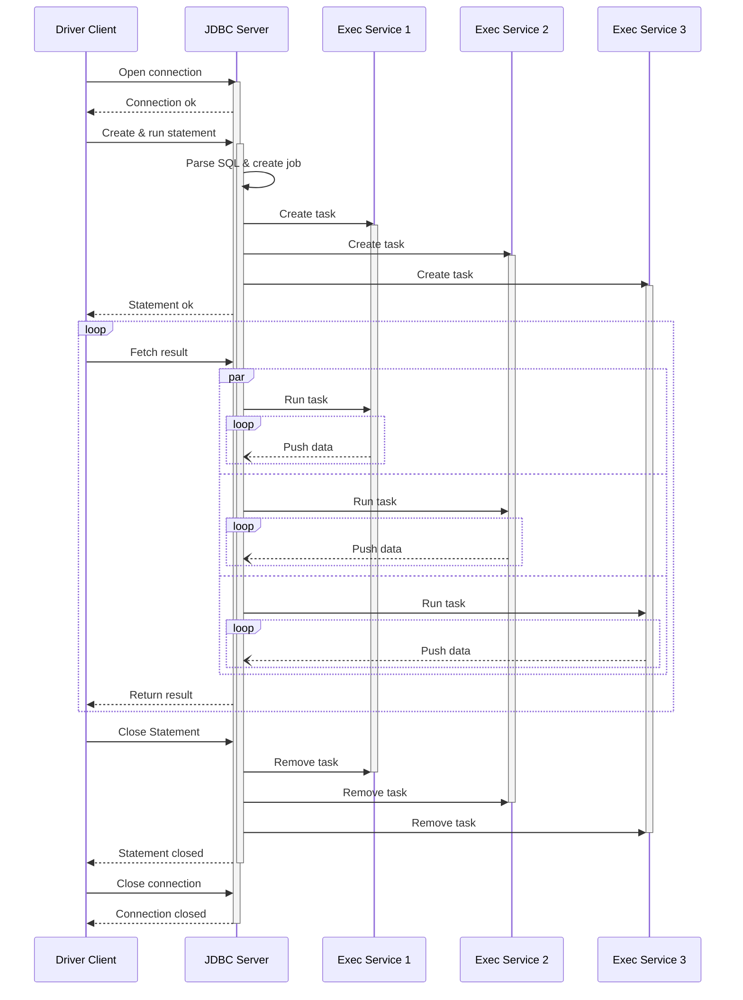
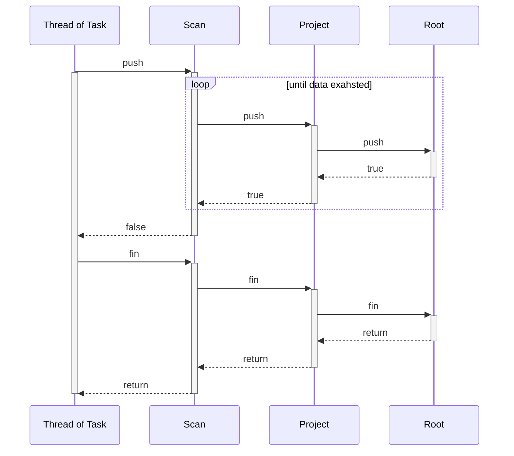

# DingoDB SQL 执行流程

## 基本流程

DingoDB 中 SQL 执行部分的架构如下图所示

一般的 DQL 和 DML 语句执行过程如下：

1. 用户通过 Dingo Driver 客户端或 MySQL 客户端输入 SQL 指令并执行
1. SQL 指令传输至任意一个 Executor, 被 JDBC Server 接收
1. JDBC Server 对收到的 SQL 指令进行解析、校验、优化等操作，逐步生成逻辑执行计划、物理执行计划和 Job, 并将 Job 提交给 Task Exec Service
1. Task Exec Service 将 Job 中的 Task 分发到各个节点，然后对其发出运行指令
1. Task 在各个节点上执行，产生的结果数据逐级推送到下游节点，直至原来分发 Task 的节点
1. JDBC Server 从 Task Exec Service 拉取结果数据
1. Dingo Dirver 客户端或 MySQL 客户端从 JDBC Server 拉取结果数据并呈现给用户

其他 DDL 和 DCL 语句有不同的执行流程，参考下图

## 执行时序

SQL 语句执行的时序如下图

Statement 与 Job 不是一一对应的关系。Statement 可以多次使用，执行多个 SQL 语句，每个 SQL 语句对应一个单独的 Job, 在同一时刻，一个 Statement 只与一个 Job 关联。

在 Prepared Statement 情形下，一个 Job 也可以执行多次，此时，Run task 命令携带每次执行需要的参数。Task Exec Service 对创建的 Task 进行登记，Job 再次执行时，JDBC Server 不需要再发送 Create Task 命令。

## Job 和 Task

Job 由物理计划生成。一个 Job 包含若干个 Task, 每个 Task 都有一个 Location 属性，Location 标明执行 Task 的节点地址。一般情况下，一个 Job 在一个节点上只有一个 Task 在执行。

每个 Task 又由若干个 Operator 组成，每个 Operator 有一个或多个输入端口，称为 Pin, 用从 0 开始的编号表示；Operator 还有 Outputs 属性，表示所有输出端口，是 一个 Output 的列表。Outputs 可以包含零到多个 Output, 每个 Output 标明它连接到的下一级 Operator 的 ID 和 Pin 编号，由此形成有向无环图。

Task 采用“推数据”的方式运行。一般来说，Operator 的 `push` 方法表示有数据输入到它的一个端口。Operator 处理完数据之后可以直接调用 Output 的 `push` 方法输出数据，而 Output 则直接调用下一级 Operator 的 `push` 方法。

有些 Operator 不需要输入数据，称为 Source Operator, 此时它的 `push` 方法作为启动 Task 运行的入口。Task 启动执行时，需要并行调用每个 Source Operator 的 `push` 方法。

Operator 的 `push` 方法返回一个 `boolean` 值，如果是 `false`, 则表示下级 Operator 不需要更多数据，这时需要停止数据处理并返回 `false`. 当 SourceOperator 的 `push` 方法返回 `false` 时，所在的线程将调用一次它的 `fin` 方法然后退出。`fin` 方法的执行逻辑同 `push` 方法但没有返回值。当 Task 的所有线程退出后，Task 执行结束。

下图表示一个由 Scan, Project, Root Operator 组成的 Task 的执行时序。线程从调用 Scan 的 `push` 方法开始。Scan 在 `push` 方法中循环枚举所有数据并推向下一级，当数据耗尽时返回 `false`, 于是 Task 线程调用 `fin` 方法并结束。如果 Root 的 `push` 方法返回 false（例如 SQL 语句存在 LIMIT 的情况下），`false` 返回值会向上级传递并导致 Scan 提前结束枚举循环。

### ID

JDBC Server 对 Connection, Statement, Job 进行管理。每个 Connection 有唯一 ID, 形式为 UUID; 每个 Statement 有唯一 ID, 为 Connection ID 与一个自增的整数值的组合。

构造 Job 时，为每个 Job 生成唯一 ID, 为 Statement ID 与一个自增整数值的组合，同时为每个 Task 和 Task 内的每个 Operator 生成以 Job ID 为前缀的唯一 ID.
